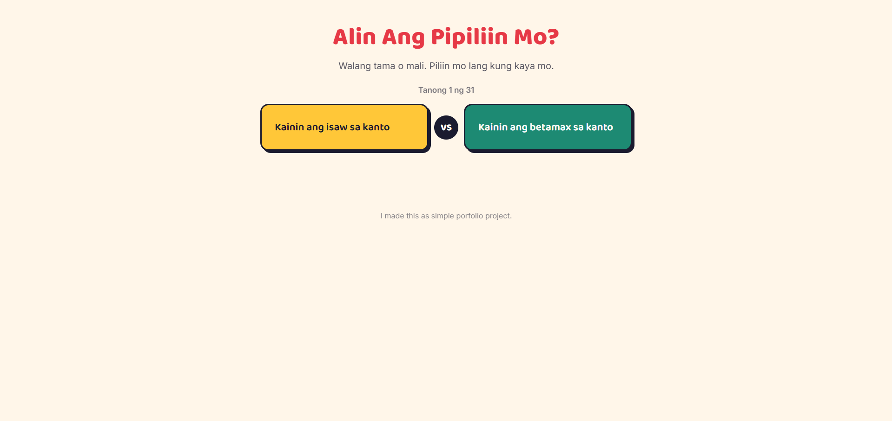

# Alin Ang Pipiliin Mo? (Would You Rather — Pinoy Edition)

A simple "Would You Rather" web game featuring dilemmas pulled from everyday
Filipino life — jeepneys vs. Grab, isaw vs. betamax, sinigang na maasim vs.
matabang, and more.

**[Live demo →](https://alin-ang-pipiliin-mo.vercel.app/)** 

## Why I built this

I wanted a beginner project that wasn't just another generic to-do list —
something with a bit of personality that I could actually explain and enjoy
building. This project helped me practice DOM manipulation, event handling,
and basic array logic (shuffling, tracking progress) in plain JavaScript.

## Features

- 30 hand-written dilemmas based on Filipino pop culture and everyday life
- Questions shuffle into a new random order every playthrough
- Progress tracker ("Tanong X ng Y")
- Restart button once you reach the end
- Fully responsive — works on mobile and desktop
- No frameworks, no build tools — just HTML, CSS, and JavaScript
- Have bonus question

## Tech stack

- HTML5
- CSS3 (custom properties, flexbox, media queries)
- Vanilla JavaScript (no libraries)

## Running it locally

1. Clone this repo
2. Open `index.html` in your browser — that's it, no build step needed

## What I'd add next

- A way to submit your own dilemmas
- Simple stats (e.g. "70% of players picked X")
- Sound effects on choice

## Author

Built by Dharel Khin Melegrito — 4th year IT student.
